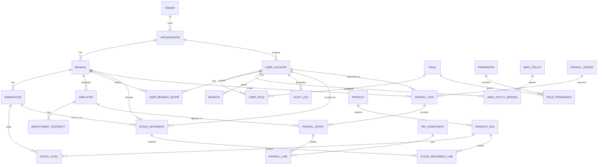

# 03 — Modelo Entidad-Relación (Inventario, Nómina, Seguridad)

## 1. Diagrama ER consolidado (Mermaid)



## 2. Dominio de Seguridad y Organización

### `tenant`
| Columna | Tipo | Notas |
|---------|------|-------|
| id | UUID PK | |
| code | VARCHAR(32) UNIQUE | |
| name | VARCHAR(200) | |
| status | ENUM | active/suspended |
| created_at | TIMESTAMPTZ | |

### `organization` / `branch`
| Columna | Tipo | Notas |
|---------|------|-------|
| id | UUID PK | |
| tenant_id | UUID FK | RLS key |
| parent_org_id | UUID NULL | |
| code | VARCHAR(32) | único por tenant |
| name | VARCHAR(200) | |
| timezone | VARCHAR(64) | |
| status | ENUM | |

`branch` hereda `tenant_id`, `org_id`, `code`, dirección fiscal, `cost_center_code`.

### `user_account`
| Columna | Tipo | Notas |
|---------|------|-------|
| id | UUID PK | = `sub` JWT |
| tenant_id | UUID FK | |
| email | CITEXT | único por tenant |
| password_hash | TEXT NULL | si IdP local |
| mfa_enabled | BOOLEAN | |
| mfa_methods | JSONB | totp/webauthn |
| status | ENUM | |
| employee_id | UUID NULL FK | self-service |
| last_login_at | TIMESTAMPTZ | |
| version | INT | optimistic lock |

### `role` / `permission` / `role_permission` / `user_role`
- `permission.code`: namespaced (`inventory.stock.adjust`, `payroll.run.approve`)
- `user_role`: `user_id`, `role_id`, `valid_from`, `valid_to`, `granted_by`
- `user_branch_scope`: `user_id`, `branch_id`, `access_level` (read/write/approve)

### `abac_policy`
| Columna | Tipo | Notas |
|---------|------|-------|
| id | UUID PK | |
| tenant_id | UUID | |
| name | VARCHAR | |
| effect | ENUM | allow/deny |
| actions | TEXT[] | |
| resource_type | VARCHAR | |
| condition | JSONB | AST o Rego ref |
| priority | INT | deny > allow |
| enabled | BOOLEAN | |

### `session`
| Columna | Tipo | Notas |
|---------|------|-------|
| id | UUID PK | `sid` |
| user_id | UUID | |
| refresh_family_id | UUID | rotación |
| amr | TEXT[] | pwd, otp, webauthn |
| ip | INET | |
| user_agent | TEXT | |
| expires_at | TIMESTAMPTZ | |
| revoked_at | TIMESTAMPTZ NULL | |

### `audit_log` (append-only)
`id`, `tenant_id`, `actor_id`, `action`, `resource_type`, `resource_id`, `branch_id`, `before`, `after`, `request_id`, `ip`, `created_at`  
Particionado por mes; sin UPDATE/DELETE de aplicación.

---

## 3. Dominio de Inventario

### `product` / `product_sku`
- `product`: nombre, categoría, brand, `is_serialized`, `is_lot_tracked`
- `product_sku`: `sku_code`, `barcode`, `uom`, `tax_code`, `reorder_point`, `reorder_qty`, `status`

### `warehouse`
`id`, `branch_id`, `code`, `name`, `type` (main/transit/quarantine), `status`

### `stock_level` (saldo actual)
| Columna | Tipo | Notas |
|---------|------|-------|
| warehouse_id | UUID | PK compuesta |
| sku_id | UUID | PK compuesta |
| qty_on_hand | NUMERIC(18,4) | |
| qty_reserved | NUMERIC(18,4) | |
| qty_available | GENERATED | on_hand - reserved |
| avg_unit_cost | NUMERIC(18,6) | |
| version | BIGINT | **optimistic lock** |
| updated_at | TIMESTAMPTZ | |

Constraint: `qty_on_hand >= 0`, `qty_reserved >= 0`, `qty_reserved <= qty_on_hand`

### `stock_movement` (cabecera)
| Columna | Tipo | Notas |
|---------|------|-------|
| id | UUID PK | |
| tenant_id | UUID | |
| branch_id | UUID | ABAC scope |
| type | ENUM | receive/issue/transfer/adjust/return |
| status | ENUM | draft/posted/void |
| source_warehouse_id | UUID NULL | |
| dest_warehouse_id | UUID NULL | |
| reference_doc | VARCHAR | PO/SO/manual |
| idempotency_key | VARCHAR | UNIQUE(tenant, key) |
| created_by | UUID | |
| posted_at | TIMESTAMPTZ | |
| posted_by | UUID | |
| reason_code | VARCHAR | obligatorio en adjust |
| version | INT | |

### `stock_movement_line`
`id`, `movement_id`, `sku_id`, `qty`, `uom`, `unit_cost`, `lot_code`, `serial_code`, `line_no`

### Concurrencia inventario
- Ajuste de stock: `UPDATE stock_level SET qty=..., version=version+1 WHERE ... AND version=:expected`
- Si 0 rows → conflicto 409; cliente reintenta con datos frescos
- Transferencias multi-almacén: **transacción local** + saga si cruza servicios; bloqueo pesimista (`SELECT FOR UPDATE`) en posting de lotes críticos

---

## 4. Dominio de Nómina

### `employee`
| Columna | Tipo | Notas |
|---------|------|-------|
| id | UUID PK | |
| tenant_id | UUID | |
| branch_id | UUID | sucursal home |
| employee_number | VARCHAR | único tenant |
| person_data | JSONB cifrado | PII envelope |
| tax_id_hash | BYTEA | búsqueda sin exponer |
| status | ENUM | active/leave/terminated |
| hired_at | DATE | |
| version | INT | |

### `employment_contract`
`id`, `employee_id`, `type`, `salary_base`, `currency`, `pay_frequency`, `work_schedule`, `valid_from`, `valid_to`, `cost_center`

### `pay_component`
Catálogo: `BASIC`, `OVERTIME`, `BONUS`, `TAX`, `SS_EMPLOYEE`, `SS_EMPLOYER`, `DEDUCTION`…  
`calc_method` (fixed/percent/formula), `is_taxable`, `side` (earning/deduction/employer)

### `payroll_period`
`id`, `tenant_id`, `code` (2026-W27), `start_date`, `end_date`, `pay_date`, `status` (open/closed)

### `payroll_run`
| Columna | Tipo | Notas |
|---------|------|-------|
| id | UUID PK | |
| period_id | UUID | |
| branch_id | UUID | |
| status | ENUM | draft/calculated/approved/paid/void |
| gross_total | NUMERIC(18,2) | |
| net_total | NUMERIC(18,2) | |
| approved_by | UUID NULL | |
| approved_at | TIMESTAMPTZ | |
| paid_at | TIMESTAMPTZ | |
| payment_batch_ref | VARCHAR | |
| version | INT | optimistic |
| lock_owner | UUID NULL | pessimistic soft-lock al calcular |

### `payroll_entry` (por empleado en un run)
`id`, `run_id`, `employee_id`, `contract_id`, `gross`, `deductions`, `net`, `employer_cost`, `status`

### `payroll_line`
`id`, `entry_id`, `component_id`, `qty`, `rate`, `amount`, `meta` JSONB

### Integridad nómina
- Un `payroll_period` cerrado → no admite nuevos runs
- Transición de estados con máquina de estados estricta
- `approved` → `paid` requiere MFA + permiso ABAC + doble control opcional (4-eyes)
- Cálculo bajo soft-lock pesimista (`lock_owner`, TTL) para evitar doble liquidación

---

## 5. Índices y RLS (esenciales)

```sql
-- Ejemplo RLS
ALTER TABLE stock_level ENABLE ROW LEVEL SECURITY;
CREATE POLICY tenant_isolation ON stock_movement
  USING (tenant_id = current_setting('app.tenant_id')::uuid);

CREATE POLICY branch_scope ON stock_movement
  USING (branch_id = ANY (string_to_array(current_setting('app.branch_ids'), ',')::uuid[]));
```

Índices clave:
- `stock_level (warehouse_id, sku_id)` PK
- `stock_movement (tenant_id, branch_id, posted_at DESC)`
- `stock_movement (tenant_id, idempotency_key)` UNIQUE
- `payroll_run (period_id, branch_id, status)`
- `payroll_entry (run_id, employee_id)` UNIQUE
- `audit_log (tenant_id, created_at DESC)`
- `user_role (user_id)` / `user_branch_scope (user_id)`

## 6. Relación seguridad ↔ módulos

```
USER ──roles──▶ PERMISSIONS ──enforce──▶ endpoints + UI nodes
  │
  └──branch_scope──▶ BRANCH ──owns──▶ WAREHOUSE / EMPLOYEES / PAYROLL_RUN
                         │
                         └── ABAC conditions (amount, MFA, time)
```

Ninguna fila de inventario o nómina se lee/escribe sin `tenant_id` + evaluación de `branch_id` en el scope del usuario (salvo roles cross-branch explícitos).
