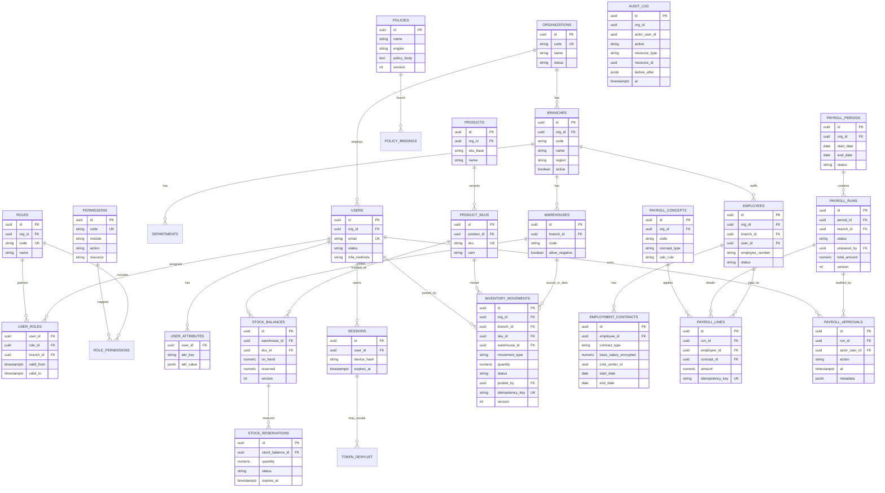

# Modelo Entidad–Relación Inicial

> Módulos: **Seguridad (RBAC/ABAC)**, **Inventario**, **Nómina**.  
> Convenciones: `uuid` PK, `org_id` en todas las tablas de negocio, `version` para optimistic locking, `created_at`/`updated_at`, soft-delete solo donde no haya requisitos legales de inmutabilidad.

---

## Diagrama ER (Mermaid)



---

## 1. Dominio de seguridad y organización

| Entidad | Propósito |
|---|---|
| `organizations` | Tenant lógico |
| `branches` | Sucursales; atributo ABAC clave |
| `departments` | Centros organizativos / cost centers |
| `users` | Identidades de aplicación (ligadas al IdP vía `idp_sub`) |
| `roles` / `permissions` / `user_roles` | RBAC; `user_roles.branch_id` permite rol scoped a sucursal |
| `user_attributes` | Atributos ABAC (`max_payroll_amount`, `warehouse_ids`, etc.) |
| `policies` / `policy_bindings` | Documentos OPA/Cedar versionados |
| `sessions` / `token_denylist` | Refresh opacos + revocación `jti` |
| `audit_log` | Append-only de acciones sensibles |

**Índices críticos:** `(org_id, email)`, `(user_id, role_id, branch_id)`, GIN sobre `user_attributes.attr_value`.

## 2. Dominio de inventario

| Entidad | Propósito |
|---|---|
| `products` / `product_skus` | Catálogo y unidad transaccional (SKU) |
| `warehouses` | Ubicaciones de stock por sucursal |
| `stock_balances` | `on_hand`, `reserved`, `version` (optimistic lock) |
| `inventory_movements` | Hecho inmutable de cambio (`RECEIPT`, `ISSUE`, `ADJUST`, `TRANSFER_*`, `VOID`) |
| `stock_reservations` | Soft-allocation con expiración |
| `inventory_counts` / `inventory_count_lines` *(fase 2)* | Conteos cíclicos con lock pesimista |

**Constraints:**

- `UNIQUE (warehouse_id, sku_id)` en `stock_balances`.
- `UNIQUE (org_id, idempotency_key)` en movimientos.
- Check: `on_hand >= 0` si `warehouses.allow_negative = false`.
- RLS: `org_id = current_setting('app.org_id')`.

## 3. Dominio de nómina

| Entidad | Propósito |
|---|---|
| `employees` | Trabajadores; `branch_id` alimenta ABAC |
| `employment_contracts` | Salario base cifrado, vigencia, cost center |
| `payroll_periods` | Ventana temporal (quincena/mes) |
| `payroll_runs` | Corrida por sucursal/periodo; máquina de estados |
| `payroll_concepts` | Percepciones/deducciones y regla de cálculo |
| `payroll_lines` | Resultado por empleado/concepto (idempotente) |
| `payroll_approvals` | Trail SoD (prepare ≠ approve) |
| `payroll_adjustments` *(fase 2)* | Correcciones post-cierre en periodo nuevo |
| `pay_disbursements` *(fase 2)* | Pagos bancarios / recibos en S3 |

**Constraints:**

- `CHECK (prepared_by <> approved_by)` enforced en servicio + trigger.
- Inmutabilidad post-`CLOSED` vía trigger `prevent_mutation`.
- Cifrado de `base_salary_encrypted` y cuentas bancarias (envelope + KMS).

## 4. Matriz de acceso (recurso × rol) — semilla

| Recurso / Acción | clerk | inv_auditor | branch_mgr | pay_analyst | pay_approver |
|---|---|---|---|---|---|
| `inventory.movement.create` | ✓ (su branch) | | ✓ | | |
| `inventory.balance.read` | ✓ | ✓ | ✓ | | |
| `inventory.count.close` | | ✓ | ✓ | | |
| `payroll.run.prepare` | | | | ✓ | |
| `payroll.run.approve` | | | | | ✓ (≠ preparador) |
| `payroll.run.read` | | | ✓ | ✓ | ✓ |
| `employee.salary.read` | | | | ✓* | ✓* |

\* Requiere MFA step-up + audit obligatorio.

## 5. SQL — esqueleto de tablas núcleo

```sql
-- Seguridad (extracto)
CREATE TABLE organizations (
  id UUID PRIMARY KEY,
  code TEXT NOT NULL UNIQUE,
  name TEXT NOT NULL,
  status TEXT NOT NULL DEFAULT 'ACTIVE'
);

CREATE TABLE branches (
  id UUID PRIMARY KEY,
  org_id UUID NOT NULL REFERENCES organizations(id),
  code TEXT NOT NULL,
  name TEXT NOT NULL,
  region TEXT,
  active BOOLEAN NOT NULL DEFAULT TRUE,
  UNIQUE (org_id, code)
);

CREATE TABLE roles (
  id UUID PRIMARY KEY,
  org_id UUID NOT NULL REFERENCES organizations(id),
  code TEXT NOT NULL,
  name TEXT NOT NULL,
  UNIQUE (org_id, code)
);

CREATE TABLE permissions (
  id UUID PRIMARY KEY,
  code TEXT NOT NULL UNIQUE, -- e.g. inventory.movement.create
  module TEXT NOT NULL,
  action TEXT NOT NULL,
  resource TEXT NOT NULL
);

CREATE TABLE user_roles (
  user_id UUID NOT NULL,
  role_id UUID NOT NULL,
  branch_id UUID REFERENCES branches(id), -- NULL = all branches in org
  valid_from TIMESTAMPTZ NOT NULL DEFAULT now(),
  valid_to TIMESTAMPTZ,
  PRIMARY KEY (user_id, role_id, COALESCE(branch_id, '00000000-0000-0000-0000-000000000000'))
);

-- Inventario (extracto)
CREATE TABLE stock_balances (
  id UUID PRIMARY KEY,
  warehouse_id UUID NOT NULL REFERENCES warehouses(id),
  sku_id UUID NOT NULL REFERENCES product_skus(id),
  on_hand NUMERIC(18,4) NOT NULL DEFAULT 0,
  reserved NUMERIC(18,4) NOT NULL DEFAULT 0,
  version INT NOT NULL DEFAULT 1,
  UNIQUE (warehouse_id, sku_id)
);

CREATE TABLE inventory_movements (
  id UUID PRIMARY KEY,
  org_id UUID NOT NULL,
  branch_id UUID NOT NULL,
  sku_id UUID NOT NULL,
  warehouse_id UUID NOT NULL,
  movement_type TEXT NOT NULL,
  quantity NUMERIC(18,4) NOT NULL,
  status TEXT NOT NULL,
  posted_by UUID NOT NULL,
  idempotency_key TEXT NOT NULL,
  version INT NOT NULL DEFAULT 1,
  created_at TIMESTAMPTZ NOT NULL DEFAULT now(),
  UNIQUE (org_id, idempotency_key)
);

-- Nómina (extracto)
CREATE TABLE payroll_runs (
  id UUID PRIMARY KEY,
  period_id UUID NOT NULL REFERENCES payroll_periods(id),
  branch_id UUID NOT NULL REFERENCES branches(id),
  status TEXT NOT NULL,
  prepared_by UUID NOT NULL,
  total_amount NUMERIC(18,2) NOT NULL DEFAULT 0,
  version INT NOT NULL DEFAULT 1
);

CREATE TABLE payroll_approvals (
  id UUID PRIMARY KEY,
  run_id UUID NOT NULL REFERENCES payroll_runs(id),
  actor_user_id UUID NOT NULL,
  action TEXT NOT NULL, -- PREPARE|APPROVE|PAY|CLOSE|REJECT
  at TIMESTAMPTZ NOT NULL DEFAULT now(),
  metadata JSONB NOT NULL DEFAULT '{}'::jsonb
);
```

## 6. Decisiones de modelado

1. **Tenant en fila (`org_id`)** + RLS: aislamiento fuerte sin schema-per-tenant inicial.
2. **Rol scoped a sucursal** en `user_roles.branch_id`: combina RBAC clásico con frontera ABAC.
3. **Movimientos como fuente de verdad** del inventario; el balance es proyección transaccional.
4. **Nómina inmutable al cierre**: evita fraude y simplifica auditoría forense.
5. **Idempotency keys** en movimientos y líneas: seguros ante retries de SPA/gateway.
6. **Atributos ABAC en JSONB** versionables sin migrar esquema por cada política nueva.
