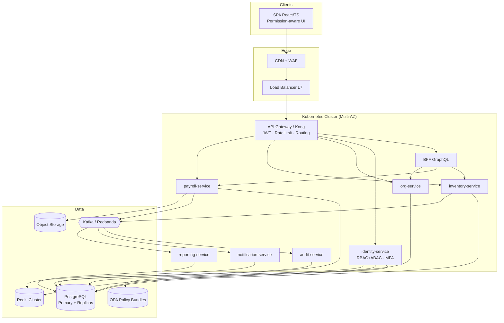
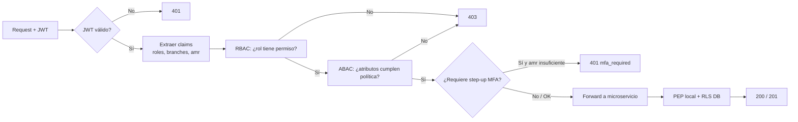
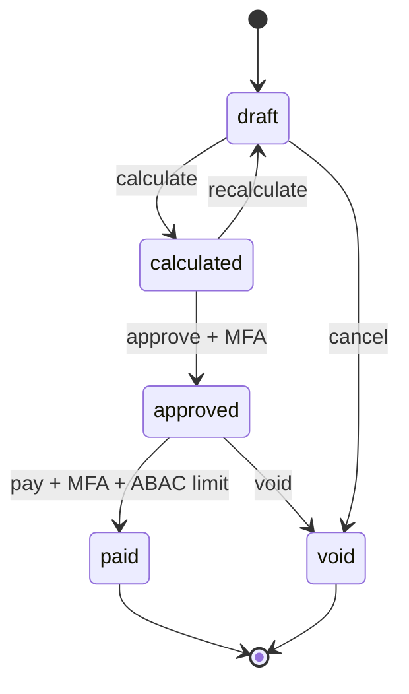
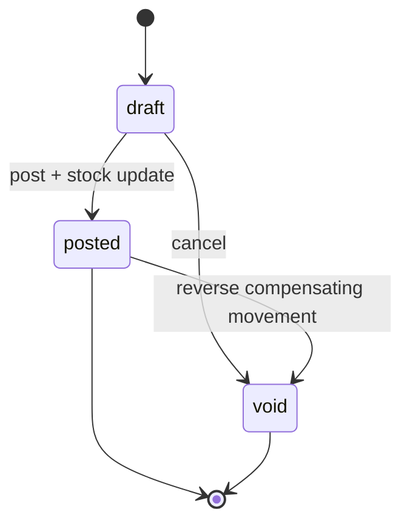
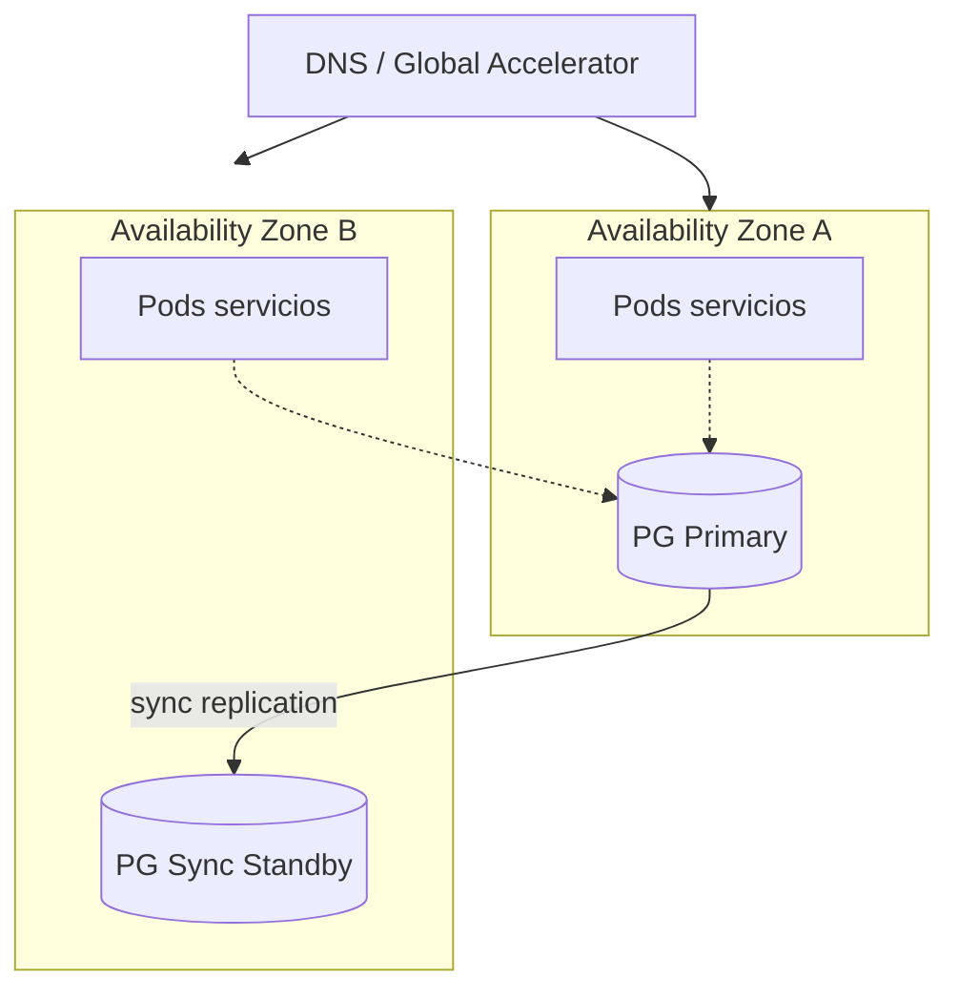

# Diagramas de Arquitectura — NexusnodesERP

## 1. Componentes (C4 Container)

## 2. Flujo de autorización (RBAC + ABAC)

## 3. Estados de nómina

## 4. Estados de movimiento de inventario

## 5. Despliegue HA

